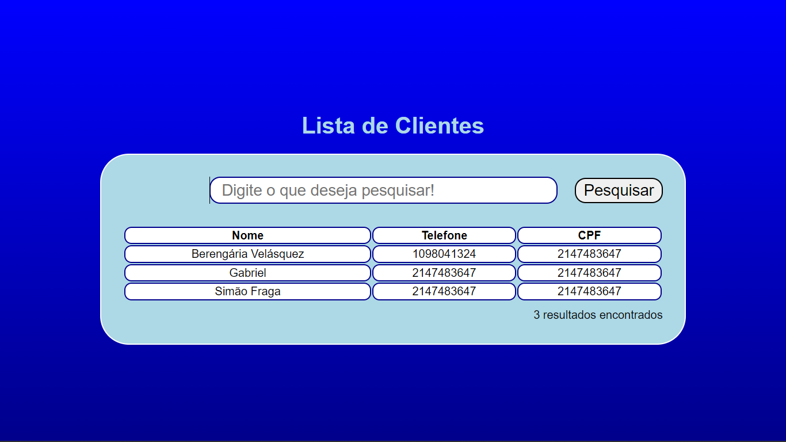

# Amostra PHP

Esse é um documento rápido apresentando uma conexão simples do PHP com o MySQL provido por um seridor local funcionando via xampp da apache!

Resultados acima estão quebrados por conta de um pequeno erro ao usar o gerenciador de banco de dados do XAMPP para criar as tabelas.